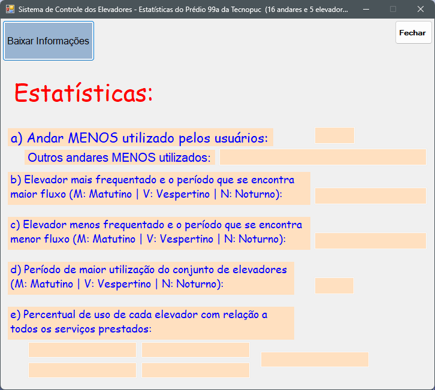
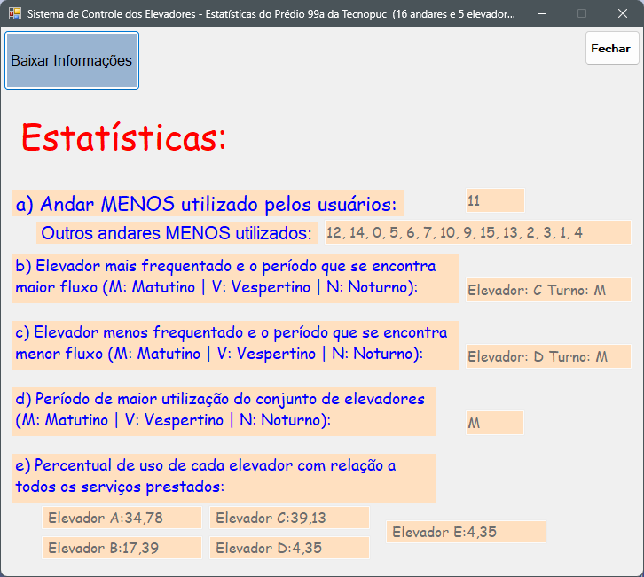
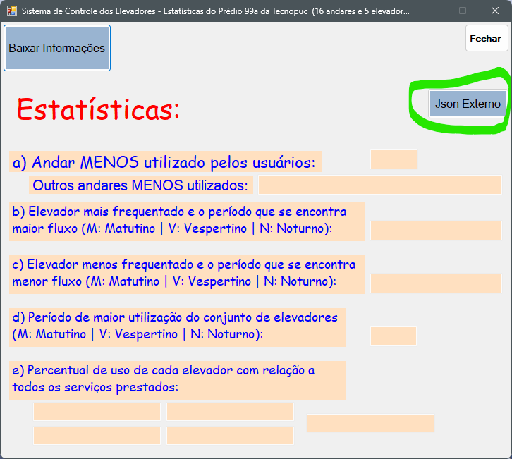

# Teste admissional prático da Apisul

## Foi criado um Botão na tela para carregar o Json (do Github).

**Um exemplo de como ficou após a Leitura do Json, como estaria sendo apresentado - *ANTES*:**

**Um exemplo de como ficou após a Leitura do Json, como estaria sendo apresentado - *APÓS*:**

## Foi criado outro Botão para carregar o Json (de um *serviço* que criei).
